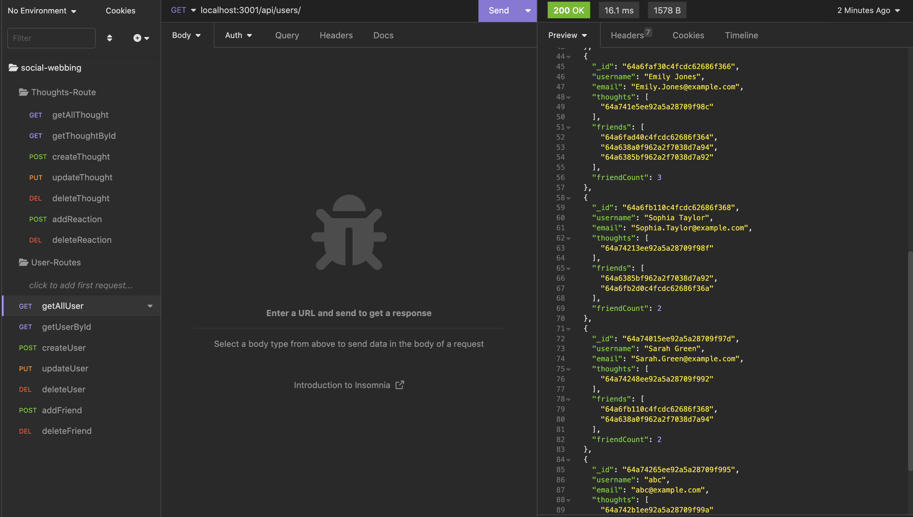
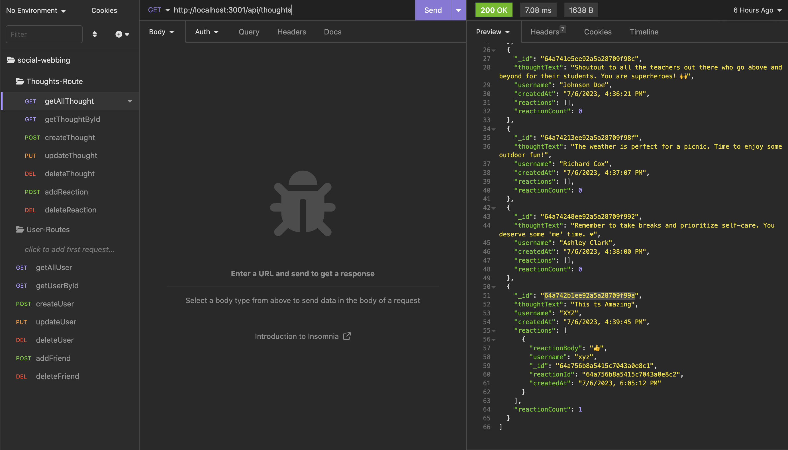

# Social - Network (NoSQL) 

## Description
    This Application uses NoSQL to build API for a Social Network  where users can share their thoughts, react to friends’ thoughts, and create a friend list. You’ll use Express.js for routing, a MongoDB database, and the Mongoose ODM. In addition to using the Express.js and Mongoose packages, you may also optionally use a JavaScript date library of your choice or the native JavaScript Date object to format timestamps.

## Tables of content:
  * [Installation](#installation)
  * [Usage](#usage)
  * [License](#license)
  * [Contributors](#contributors)
  * [Test](#test)
  * [Questions](#questions)

## Installation

1. Install node.js to run this application
2. Create a .gitignore file and include node_modules/ and .DS_Store/ so that your node_modules directory isn't tracked or uploaded to GitHub. Be sure to create your .gitignore file before installing any npm dependencies.
3. Make sure that your repo includes a package.json with the required dependencies. You can create one by running npm init when you first set up the project, before installing any dependencies.
4. Install MongoDb to create database
5. Run command npm i express to create Express.js for Routing.
6. Run command npm i mongoose to create mongoose package to connect MongoDB database.
7. The application will be invoked by using the following command: node server.js.This will start localhost server on PORT 3001.
8. Open browser and type http://localhost:3001 to run this application on your local machine.
9. For testing Open insomnia and type http://localhost:3001/ with necessary API routes.

## Usage 

1. This App code can be used as a base to structure a social network API..
2. MongoDB is a popular choice for many social networks due to its speed with large amounts of data and flexibility with unstructured data.
3. GIVEN a social network API
  WHEN I enter the command to invoke the application, THEN my server is started and the Mongoose models are synced to the MongoDB database
4. WHEN I open API GET routes in Insomnia for users and thoughts, THEN the data for each of these routes is displayed in a formatted JSON
5. WHEN I test API POST, PUT, and DELETE routes in Insomnia, THEN I am able to successfully create, update, and delete users and thoughts in my database
6. WHEN I test API POST and DELETE routes in Insomnia, THEN I am able to successfully create and delete reactions to thoughts and add and remove friends to a user’s friend list.
7. Application deletes a user's associated thoughts when the user is deleted.

## License  
* This application is licensed under : 
* Click the link for the detailed license information: https://choosealicense.com/licenses/isc/

## Contributors
shruthi

## Test
npm test

## Questions
  * GitHub Username : shruthisalimath
  * Email: shruthi@test.com
  * GitHub profile : https://github.com/shruthisalimath 

## Mock Up

## ScreenShot
1. GET - Users

2. GET - Thoughts

## URL
1. The URL of the walkthrough video demonstrating the functionality of the application and all of the acceptance criteria being met.

  
2. The URL of the GitHub repository.
  https://github.com/shruthisalimath/Social-webbing